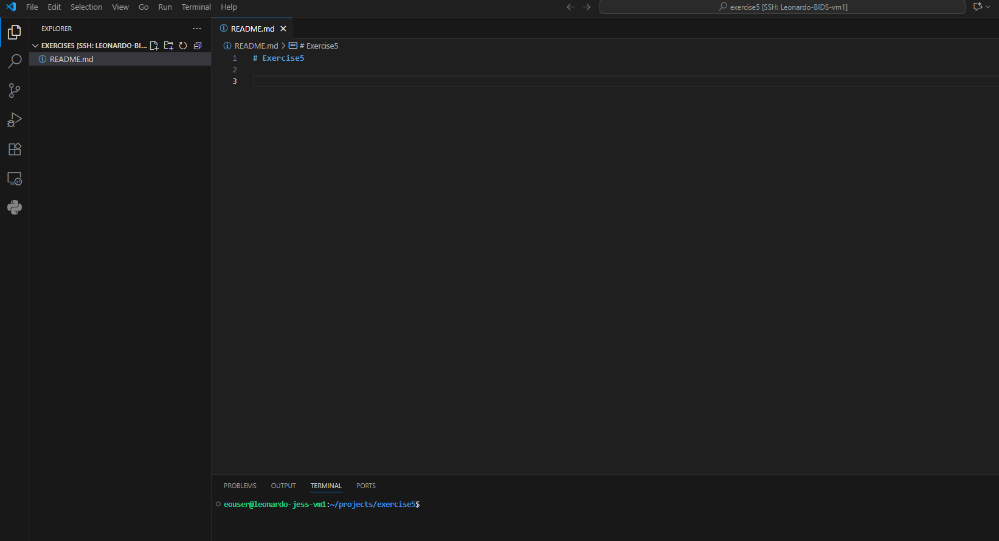
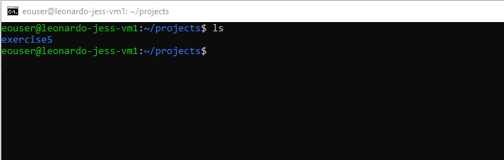
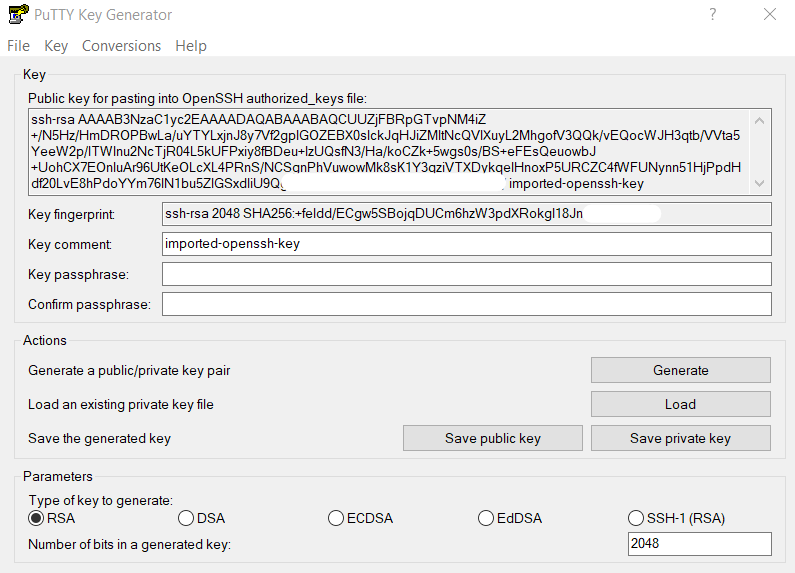
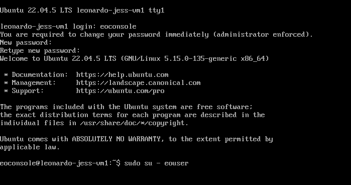

# VM Connection

Here we look at different ways of connecting to a VM

## Exercises

- ssh_vscode.md (if you have vscode it nicer to use it)
- ssh_putty.md (if you don't have vscode - and have putty puttygen already)
- ssh_command_prompt (if you don't have putty or vscode)
- horizon_console (shows how to access with horizon console : not ideal for working)

### VS Code

- With VS Code we have a full development environment on a remote VM. 
- It is more powerful and flexible

### Command Line

The windows command line (or WSL2 Ubuntu)

- e.g. C:\Users\jburford\.ssh>ssh -i jess-bids-key-private-leonardo eouser@<floating_ip>
- Use tools like 'nano' to modify files

### Putty

- Putty is well known and conventient for connecting with SSH however there are a few steps

### Horizon Console

- You can also connect to the vm through the Horizon Interface.
- However, this is limited and has issues with keyboard layout that will probably need to be resolved (beyond scope of this training)

