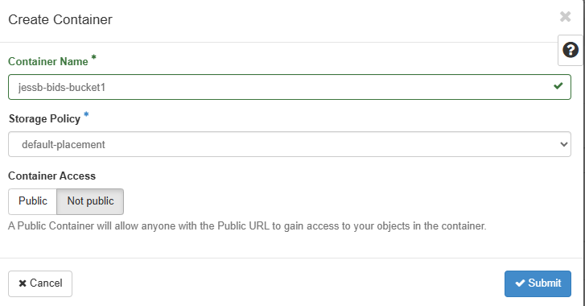

## Buckets

- These exercises walk you through some concepts of working with buckets

## Excercises

- 0_create_a_bucket.md : Create a bucket using OpenStack Horizon Interface
- 1_rc_file.md : Accessing the Application Credential RC File (Global version) : Id and Secret must be provided in 2nd step
- 2_application_credentials.md : Generating Application Credentials : i.e. a given Id and Secret with given roles
- 3_ec2_credentials.md : Use openstack cli to generate ec2 credentials (used in s3cmd to interact with private bucket)
- 4_private_buckets_s3cmd.md : Interact with a private bucket

## Create a bucket

- Notice that it is not public by default
